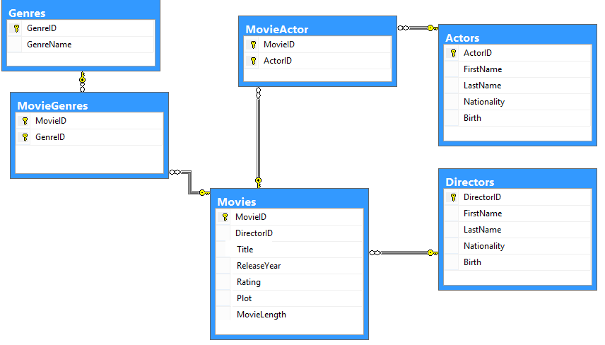

Введение в SQL
==============

--------------

Что такое SQL?
==============

    `SQL`_ (Structured Query Language — «язык структурированных запросов») —
    формальный непроцедурный язык программирования,
    применяемый для создания, модификации и управления данными в реляционной б/д,
    управляемой СУБД.

.. _SQL: https://ru.wikipedia.org/wiki/SQL

Краткая история
---------------

В начале 1970-х годов в одной из исследовательских лабораторий компании
IBM была разработана экспериментальная
реляционная СУБД IBM System R, для которой затем был создан специальный
язык SEQUEL, позволявший относительно
просто управлять данными в этой СУБД.

Аббревиатура SEQUEL расшифровывалась как **Structured English QUEry Language** —
«структурированный английский язык запросов».

Целью разработки было создание простого непроцедурного языка, которым мог воспользоваться любой пользователь,
даже не имеющий навыков программирования.

--------------

Стандарты
=========

Поскольку к началу 1980-х годов существовало несколько вариантов СУБД от
разных производителей, причём каждый
из них обладал собственной реализацией языка запросов, было принято
решение разработать стандарт языка, который
будет гарантировать переносимость ПО с одной СУБД на другую (при условии,
что они будут поддерживать этот стандарт).

В 1983 году Международная организация по стандартизации (ISO) и
Американский национальный институт стандартов (ANSI)
приступили к разработке стандарта языка SQL.

===== ========== ===============================================
Год    Название  Изменения
===== ========== ===============================================
1986  SQL-86     Первый вариант стандарта,
                 принятый институтом ANSI и
                 одобренный ISO в 1987 году.

1989  SQL-89     Немного доработанный вариант
                 предыдущего стандарта.

1992  SQL-92     Значительные изменения (ISO 9075);
                 уровень ''Entry Level'' стандарта
                 SQL-92 был принят как стандарт
                 FIPS 127-2.

1999  SQL:1999   Добавлена поддержка регулярных выражений,
                 рекурсивных запросов, поддержка триггеров,
                 базовые процедурные расширения, нескалярные
                 типы данных и некоторые объектно-ориентированные
                 возможности.

2003  SQL:2003   Введены расширения для работы с XML-данными,
                 оконные функции (применяемые для работы с
                 OLAP-базами данных), генераторы
                 последовательностей и основанные на них типы
                 данных.

2006  SQL:2006   Функциональность работы с XML-данными значительно
                 расширена. Появилась возможность совместно
                 использовать в запросах SQL и XQuery.

2008  SQL:2008   Улучшены возможности оконных функций, устранены
                 некоторые неоднозначности стандарта SQL:2003
===== ========== ===============================================

--------------

Назначение SQL
==============

Основное назначение:

- создание в базе данных новой таблицы;
- добавление в таблицу новых записей;
- изменение записей;
- удаление записей;
- выборка записей из одной или нескольких таблиц (в соответствии с заданным условием);
- изменение структур таблиц.

--------------

Категории команд SQL
====================

Основные категории команд языка SQL предназначены для выполнения различных функций:

- DDL (Data Definition Language) позволяет создавать и
  изменять структуру объектов б/д, например, создавать и удалять таблицы.

- DML (Data Manipulation Language) используется для
  манипулирования информацией внутри объектов реляционной б/д

- DQL (Data Query Language) включает одну команду **SELECT**.
  Эта команда используется для формирования запросов к реляционной б/д.

- DCL (Data Control Language) позволяют управлять доступом к информации,
  находящейся внутри б/д. Как правило, они используются для создания объектов,
  связанных с доступом к данным, а также служат для контроля над
  распределением привилегий между пользователями.

- команды администрирования данных.

- команды управления транзакциями.

--------------

Типы данных SQL [#]_
====================

- Целые числа
- Дробные числа
- Строки
- Бинарные данные
- Дата и время

.. [#] `Типы данных MS Access`_

.. _`Типы данных MS Access`: https://support.office.com/ru-ru/article/%d0%92%d0%b2%d0%b5%d0%b4%d0%b5%d0%bd%d0%b8%d0%b5-%d0%b2-%d0%b8%d1%81%d0%bf%d0%be%d0%bb%d1%8c%d0%b7%d0%be%d0%b2%d0%b0%d0%bd%d0%b8%d0%b5-%d1%82%d0%b8%d0%bf%d0%be%d0%b2-%d0%b4%d0%b0%d0%bd%d0%bd%d1%8b%d1%85-%d0%b8-%d1%81%d0%b2%d0%be%d0%b9%d1%81%d1%82%d0%b2-%d0%bf%d0%be%d0%bb%d0%b5%d0%b9-30ad644f-946c-442e-8bd2-be067361987c?ui=ru-RU&rs=ru-RU&ad=RU

--------------

`Целые числа`_
===========

- TINYINT(M)	Может хранить числа от -128 до 127
- SMALLINT(M)	Диапазон от -32 768 до 32 767
- MEDIUMINT(M)	Диапазон от -8 388 608 до 8 388 607
- INT(M)	    Диапазон от -2 147 483 648 до 2 147 483 647
- INTEGER(M)    Синоним для INT.
- BIGINT(M)     Диапазон от -9 223 372 036 854 775 808 до 9 223 372 036 854 775 807

Необязательный флаг UNSIGNED задает, что будет создано поле для хранения
без знаковых чисел (больших или равных 0).

Необязательный параметр М - количество отводимых под число символов.

Необязательный атрибут ZEROFILL позволяет свободные позиции по умолчанию
заполнить нулями.

Пример:
    INT (4) - предполагается, что значения будут четырехзначные,
    но по факту будет хранить максимально возможные.

    INT (5) ZEROFILL - свободные позиции слева заполнит нулями.
    Например, величина 2 будет отображаться, как 00002.

.. _Целые числа: http://site-do.ru/db/sql2.php

--------------

Дробные числа
=============

- FLOAT(M, D)   Число с плавающей точкой небольшой точности.
- DOUBLE(M, D)	Число с плавающей точкой двойной точности.
- REAL(M, D)	Синоним для DOUBLE.
- DECIMAL(M, D)	Дробное число, хранящееся в виде строки.
- NUMERIC(M, D)	Синоним для DECIMAL.

Могут иметь параметр UNSIGNED, запрещающий отрицательные числа,
но диапазон значений от этого не изменится.

Необязательный параметр M - количество отводимых под число символов.

Необязательный параметр D - количество символов дробной части.

Пример:
    FLOAT (5,2) - будет хранить числа из 5 символов,
    2 из которых будут идти после запятой (например: 46,58).

--------------

Строки
======

Строки представляют собой массивы символов.

- CHAR(M)  символьные строки фиксированной длины М.
- VARCHAR(M) символьная строка переменной длины М.
- TINYTEXT	Может хранить не более 255 символов.
- TEXT	Может хранить не более 65 535 символов.
- MEDIUMTEXT	Может хранить не более 16 777 215 символов.
- LONGTEXT	Может хранить не более 4 294 967 295 символов.

Примеры:
    CHAR (8) - хранит строки из 8 символов и занимает 8 байтов.
    Например, любое из следующих значений: '', 'Иван','Ирина', 'Сергей' будет
    занимать по 8 байтов памяти. А при попытке ввести значение 'Александра',
    оно будет усечено до 'Александ', т.е. до 8 символов.

    VARCHAR (3) - хранит строки максимум из 3 символов, но пустая
    строка '' занимает 1 байт памяти, строка 'a' - 2 байта, строк 'aa' - 3 байта,
    строка 'aaa' - 4 байта. Значение более 3 символов будет усечено до 3.

--------------

Бинарные данные
===============

Позволяют хранить данные любого объема в двоичном коде (оцифрованные изображения,
исполняемые файлы и т.д.). Определения этих типов наиболее сильно различаются от
системы к системе, часто используются ключевые слова:

- BINARY
- BYTE
- BLOB

--------------

Дата и время
============

Используются для хранения даты, времени и их комбинаций.

- DATE - тип данных для хранения даты.
- TIME - тип данных для хранения времени.
- INTERVAL - тип данных для хранения верменного интервала.
- DATETIME - тип данных для хранения моментов времени
  (год + месяц + день + часы + минуты + секунды + доли секунд).
- TIMESTAMP	Дата и время в формате timestamp.

--------------

Другие типы данных
==================

- ENUM(x,y,z,etc.) Позволяет вводить список допустимых значений.
  Можно ввести до 65535 значений

- SET тип данных SET напоминает ENUM за исключением того, ч
  то SET может содержать до 64 значений.

- NULL - Это не тип данных, а значение. По сути указатель возможности отсутствия значения.

--------------

DDL (работа со структурой базы)
===============================

`Команды DDL`_ подразумевают под собой создание и организацию структуры
как самой б/д так и ее объектов.
Со строками такая группа операторов `не` работает вовсе.

- **CREATE** — создание объекта (например таблицы);

- **ALERT** — изменение объекта (например добавление/изменение полей);

- **DROP** — удаление объекта;

.. _Команды DDL: http://webadequate.ru/rabota-s-bd-mysql/43-grading_sql_commands.html

--------------

Операторы базы данных
=====================

`Создание базы данных:`_
------------------------

.. sourcecode:: sql

    CREATE DATABASE [IF NOT EXISTS] <имя_базы>;

.. _Создание базы данных:: http://dev.mysql.com/doc/refman/5.7/en/create-database.html

Удаление базы данных:
---------------------

.. sourcecode:: sql

    DROP DATABASE [IF EXISTS] <имя_базы>;

--------------

Создание и удаление таблиц
==========================

Создание таблицы:
-----------------

.. sourcecode:: sql

    CREATE TABLE [IF NOT EXISTS] <имя_таблицы>
    (
       <имя_столбца> <тип_столбца>
       [NOT NULL | NULL] [DEFAULT <значение_по_умолчанию>]
       [AUTO_INCREMENT | IDENTITY] [UNIQUE [KEY] | [PRIMARY] KEY]
       [COMMENT 'комментарий']
       [[ FOREIGN KEY ] REFERENCES <имя_мастер_таблицы>(<имя_столбца>)]
       , ...
    );

Удаление таблицы:
-----------------

.. sourcecode:: sql

    DROP TABLE [IF EXISTS] <имя_таблицы>

--------------

Пример б/д publications
=======================

--------------

Создание б/д
============

Создание базы данных publications
---------------------------------

.. sourcecode:: sql

    CREATE DATABASE publications;

Выбор базы данных publications
------------------------------

.. sourcecode:: sql

    USE publications;

Создание таблицы authors
------------------------

.. sourcecode:: sql

    -- создание таблицы авторов. Ключ AUTO_INCREMENT спецефичен для MySQL.
    -- в T-SQL применяется свойство IDENTITY
    CREATE TABLE authors
    (
    	au_id INT PRIMARY KEY AUTO_INCREMENT,
        author VARCHAR(25) NOT NULL
    );

--------------

Создание таблиц
===============

Создание таблицы publishers и titles
------------------------------------

|tbl_publishers_titles|

.. sourcecode:: sql

    -- таблица издателей
    CREATE TABLE publishers
    (
    	pub_id INT PRIMARY KEY AUTO_INCREMENT,
        publisher VARCHAR(255) NOT NULL,
    	url VARCHAR(255)
    );

..  sourcecode:: sql

    -- таблица публикаций
    CREATE TABLE titles
    (
    	title_id INT PRIMARY KEY  AUTO_INCREMENT,
        title VARCHAR(255) NOT NULL,
    	yearpub INT,
        pub_id INT FOREIGN KEY REFERENCES publishers(pub_id)
    );

--------------

Создание таблиц
===============

Создание таблицы wwwsites и wwwsiteauthors
------------------------------------------

.. sourcecode:: sql

    -- создание таблицы веб-сайтов
    CREATE TABLE wwwsites
    (
        site_id INT PRIMARY KEY AUTO_INCREMENT,
    	site VARCHAR(255) NOT NULL,
    	url VARCHAR(255)
    );

.. sourcecode:: sql

    -- промежуточная таблица связывающая веб-сайты с авторами
    CREATE TABLE wwwsiteauthors
    (
        au_id INT FOREIGN KEY REFERENCES authors(au_id),
        site_id INT FOREIGN KEY REFERENCES wwwsites(site_id)
    );

--------------

Создание таблиц
===============

Создание таблицы titleautors
----------------------------

.. sourcecode:: sql

    -- промежуточная таблица связывает авторов с публикациями
    CREATE TABLE titleautors
    (
        au_id INT FOREIGN KEY REFERENCES authors(au_id),
        title_id INT FOREIGN KEY REFERENCES titles(title_id)
    );

--------------

Модификация таблицы (ALERT)
===========================

Добавить столбцы
----------------

.. sourcecode:: sql

    ALTER TABLE <имя_таблицы> ADD
    (
        <имя_столбца> <тип_столбца>
        [NOT NULL]
        [UNIQUE | PRIMARY KEY]
        [REFERENCES <имя_мастер_таблицы>(<имя_столбца>)]
      	,...
    );

Удалить столбцы
---------------

.. sourcecode:: sql

    ALTER TABLE <имя_таблицы> DROP (<имя_столбца>,...)

Модификация типа столбцов
-------------------------

.. sourcecode:: sql

    ALTER TABLE <имя_таблицы> MODIFY
       <имя_столбца> <тип_столбца>
       [NOT NULL]
       [UNIQUE | PRIMARY KEY]
       [[FOREIGN KEY] REFERENCES <имя_мастер_таблицы>(<имя_столбца>)]]
       ,...)

--------------

Пример модификации таблицы
==========================

.. sourcecode:: sql

    -- Создание таблицы students
    CREATE TABLE students
    (
        id INT NOT NULL AUTO_INCREMENT PRIMARY KEY,
        name VARCHAR(255) NOT NULL,
        group VARCHAR(255) NULL DEFAULT NULL
    );

.. code-block:: sql

    -- Добавление в таблицу students поля "date birth" после поля ID
    -- с разрешением не заполненных значений.
    ALTER TABLE students
        ADD COLUMN `date birth` DATE NULL AFTER id;

.. code-block:: sql

    -- Удаление таблицы studets.
    DROP TABLE studets;

--------------

Задание
=======

..
    --------------
    Оператор SELECT
    ===============
    --------------
    Выборка с оператором WHERE
    =========================
    --------------
    Сортировка данных
    =================
    --------------
    Многотабличные запросы. Декартовое множество
    ============================================

