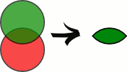

Основы реляционной алгебры
=============================

----

    Реляционная алгебра базируется на теории множеств и является основой логики работы баз данных. 

    Основы теории реляционных баз данных, равно как и операции реляционной алгебры, были предложены Эдгаром Коддом во время работы в компании IBM

.. image:: https://upload.wikimedia.org/wikipedia/ru/5/58/Edgar_F_Codd.jpg

----

Операции реляционной алгебры
============================

Основные восемь операций реляционной алгебры: 
---------------------------------------------

Традиционные операции над множествами:

- Объединение
- Пересечение
- Вычитание
- Декартово произведение

Специальные реляционные операции:

- Выборка
- Проекция
- Соединение
- Деление

Результатом любой операции алгебры над отношениями **является еще одно отношение**, которое можно потом так же использовать в других операциях.

----

Проекция
========

Проекция является операцией, при которой из отношения выделяются атрибуты только из указанных доменов, то есть из таблицы выбираются только нужные столбцы, при этом, если получится несколько одинаковых кортежей, то в результирующем отношении остается только по одному экземпляру подобного кортежа.

Пример
------

Таблица People

====== ==== =======
Name	Age	Weight
====== ==== =======
Harry	34	80

Sally	28	64

George	29	70

Helena	54	54

Peter	34	80
====== ==== =======

Результат проекции: π\ :sub:`(Age, Weight)`\ People

=== ======
Age	Weight
=== ======
28	64

29	70

54	54

34	80
=== ======

Эквивалентный SQL-запрос:

.. sourcecode:: sql

    SELECT DISTINCT Age, Weight FROM People;

Примечательно, что в SQL для полного соответствия операции проекции необходимо указывать ключевое слово DISTINCT, поскольку без него строка с возрастом 34 и весом 80 отобразится дважды, что отличается от результата реляционной операции проекции1.

----

Выборка
=======

Выборка — это операция, которая выделяет множество строк в таблице, удовлетворяющих заданным условиям. 

Условием может быть любое логическое выражение. 

Пример
------

Таблица People

====== ==== =======
Name	Age	Weight
====== ==== =======
Harry	34	80

Sally	28	64

George	29	70

Helena	54	54

Peter	34	80
====== ==== =======

Результаты выборки: σ\ :sub:`(Age≥34)`\ People

====== ==== =======
Name	Age	Weight
====== ==== =======
Harry	34	80

Helena	54	54

Peter	34	80
====== ==== =======

Эквивалентный SQL-запрос:

.. sourcecode:: sql

    SELECT * FROM People WHERE Age >= 34;

----

Выборка и проекция
==================

Совместим операторы проекции и выборки. Мы можем это сделать, потому что любой из операторов в результате возвращает отношение и в качестве аргументов использует также отношение.

Исходная таблица People

+----+--------+-----+--------+
| id | name   | age | weight |
+====+========+=====+========+
|  1 | Harry  |  34 |     80 |
+----+--------+-----+--------+
|  2 | Sally  |  28 |     64 |
+----+--------+-----+--------+
|  3 | George |  29 |     70 |
+----+--------+-----+--------+
|  4 | Helena |  54 |     54 |
+----+--------+-----+--------+
|  5 | Peter  |  34 |     80 |
+----+--------+-----+--------+

Результаты выборки: π\ :sub:`(name, age)`\ σ\ :sub:`(age>50)`\ People

+--------+-----+
| name   | age |
+========+=====+
| Helena |  54 |
+--------+-----+

Эквивалентный SQL-запрос:

.. sourcecode:: sql

    SELECT name, age FROM People WHERE age > 50;

или

.. sourcecode:: sql
    
    SELECT name, age FROM (SELECT * FROM People WHERE age > 50) AS t;

----

Объединение (команда UNION)
===========================

Результатом объединения отношений A и B будет отношение с тем же заголовком, что и у совместимых по типу отношений A и B, и телом, состоящим из кортежей, принадлежащих или A, или B, или обоим отношениям.

Пример объединения таблиц
=========================

Таблица People

+----+--------+-----+--------+
| id | name   | age | weight |
+====+========+=====+========+
|  1 | Harry  |  34 |     80 |
+----+--------+-----+--------+
|  2 | Sally  |  28 |     64 |
+----+--------+-----+--------+
|  3 | George |  29 |     70 |
+----+--------+-----+--------+
|  4 | Helena |  54 |     54 |
+----+--------+-----+--------+
|  5 | Peter  |  34 |     80 |
+----+--------+-----+--------+

Таблица Characters

+----+---------+-----+--------+
| id | name    | age | weight |
+====+=========+=====+========+
|  1 | Daffy   |  24 |     19 |
+----+---------+-----+--------+
|  2 | Donald  |  25 |     23 |
+----+---------+-----+--------+
|  3 | Scrooge |  81 |     27 |
+----+---------+-----+--------+

----

Результат объединения таблиц
============================

Объединенная таблица
--------------------

+----+---------+-----+--------+
| id | name    | age | weight |
+====+=========+=====+========+
|  1 | Harry   |  34 |     80 |
+----+---------+-----+--------+
|  2 | Sally   |  28 |     64 |
+----+---------+-----+--------+
|  3 | George  |  29 |     70 |
+----+---------+-----+--------+
|  4 | Helena  |  54 |     54 |
+----+---------+-----+--------+
|  5 | Peter   |  34 |     80 |
+----+---------+-----+--------+
|  1 | Daffy   |  24 |     19 |
+----+---------+-----+--------+
|  2 | Donald  |  25 |     23 |
+----+---------+-----+--------+
|  3 | Scrooge |  81 |     27 |
+----+---------+-----+--------+

Эквивалентный SQL запрос:

.. sourcecode:: sql

    SELECT * FROM People 
    UNION 
    SELECT * FROM Characters;
..

    Вопрос: как отсортировать результат объединения двух таблиц по возрасту?

.notes: :code:`SELECT * FROM People UNION SELECT * FROM Characters ORDER BY age;`

----

Пересечение
===========

Результатом пересечения отношений A и B будет отношение с тем же заголовком, что и у отношений A и B, и телом, состоящим из кортежей, принадлежащих одновременно обоим отношениям A и B.

Таблица People

+----+--------+-----+--------+
| id | name   | age | weight |
+====+========+=====+========+
|  1 | Harry  |  34 |     80 |
+----+--------+-----+--------+
|  2 | Sally  |  28 |     64 |
+----+--------+-----+--------+
|  3 | George |  29 |     70 |
+----+--------+-----+--------+
|  4 | Helena |  54 |     54 |
+----+--------+-----+--------+
|  5 | Peter  |  34 |     80 |
+----+--------+-----+--------+

Таблица Characters

+----+---------+-----+--------+
| id | name    | age | weight |
+====+=========+=====+========+
|  1 | Daffy   |  24 |     19 |
+----+---------+-----+--------+
|  2 | Donald  |  25 |     23 |
+----+---------+-----+--------+
|  3 | Scrooge |  81 |     27 |
+----+---------+-----+--------+
|  4 | George  |  29 |     70 |
+----+---------+-----+--------+
|  5 | Sally   |  28 |     64 |
+----+---------+-----+--------+

----

Результат пересечения таблиц
============================

Пересечение таблиц
------------------

+--------+-----+--------+
| name   | age | weight |
+========+=====+========+
| Sally  |  28 |     64 |
+--------+-----+--------+
| George |  29 |     70 |
+--------+-----+--------+

Эквивалентный SQL запрос MSSQL и Access:

.. sourcecode:: sql

    TSQL> SELECT name, age, weight FROM People 
          INTERSECT 
          SELECT name, age, weight FROM Characters;

Эквивалентный запрос в MySql:

.. sourcecode:: sql

   mysql> SELECT DISTINCT 
                   People.name AS name, 
                   People.age AS age, 
                   People.weight AS weight 
          FROM People 
          INNER JOIN Characters 
          USING(name, age, weight);

----

Разность
========

Результатом разности отношений A и B будет отношение с тем же заголовком, что и у совместимых по типу отношений A и B, и телом, состоящим из кортежей, принадлежащих отношению A и не принадлежащих отношению B.

.. image:: img/except.png

----

Результат разности
==================

+--------+-----+--------+
| name   | age | weight |
+========+=====+========+
| Harry  |  34 |     80 |
+--------+-----+--------+
| Helena |  54 |     54 |
+--------+-----+--------+
| Peter  |  34 |     80 |
+--------+-----+--------+

Эквивалентный SQL запрос MSSQL и Access:

.. sourcecode:: sql
    
    TSQL> SELECT name, age, weight FROM People
          EXCEPT
          SELECT name, age, weight FROM Characters;

Эквивалентный запрос в MySql:

.. sourcecode:: sql

    mysql> SELECT DISTINCT 
                People.name AS name, 
                People.age AS age, 
                People.weight AS weight 
           FROM People 
           LEFT OUTER JOIN Characters 
           USING (name, age, weight) 
           WHERE Characters.name IS NULL;

----

Декартово произведение
======================

При выполнении прямого произведения двух отношений производится отношение, кортежи которого являются конкатенацией (сцеплением) кортежей первого и второго операндов.

Пусть даны соотношения (таблицы):

Таблица Cartoons

+------------+--------------+
| id_cartoon | name_cartoon |
+============+==============+
|          1 | The Simpsons |
+------------+--------------+
|          2 | Family Guy   |
+------------+--------------+

Таблица Chanels

+-----------+-------------+
| id_chanel | name_chanel |
+===========+=============+
|         1 | 1+1         |
+-----------+-------------+
|         2 | СТБ         |
+-----------+-------------+

Результат произведения   Cartoons × Chanels

+------------+--------------+-----------+-------------+
| id_cartoon | name_cartoon | id_chanel | name_chanel |
+============+==============+===========+=============+
|          1 | The Simpsons |         1 | 1+1         |
+------------+--------------+-----------+-------------+
|          2 | Family Guy   |         1 | 1+1         |
+------------+--------------+-----------+-------------+
|          1 | The Simpsons |         2 | СТБ         |
+------------+--------------+-----------+-------------+
|          2 | Family Guy   |         2 | СТБ         |
+------------+--------------+-----------+-------------+

----

Эквивалентный SQL запрос:

.. sourcecode:: sql

    SELECT * FROM Cartoons, Chanels;

Альтернативный запрос:

.. sourcecode:: sql

    SELECT * FROM Cartoons CROSS JOIN Chanels;

----

Деление
=======

Деление отношений - создает новое отношение, содержащее атрибуты первого
отношения, отсутствующие во втором отношении и кортежи первого отношения,
которые совпали кортежами второго. 

Для выполнения этой операции второе отношения должно содержать лишь атрибуты, 
совпадающие с атрибутами первого.

Операция деления полезна тогда, когда запрос содержит слово «все». 

Пример
======

Даны следующие соотношения:

Таблица Cartoons

+------------+--------------+-------------+
| id_cartoon | name_cartoon | name_chanel |
+============+==============+=============+
|          0 | The Simpsons | Inter       |
+------------+--------------+-------------+
|          0 | The Simpsons | 1+1         |
+------------+--------------+-------------+
|          0 | The Simpsons | СТБ         |
+------------+--------------+-------------+
|          1 | Family Guy   | Inter       |
+------------+--------------+-------------+
|          1 | Family Guy   | 1+1         |
+------------+--------------+-------------+
|          2 | Duck Tales   | СТБ         |
+------------+--------------+-------------+
|          2 | Duck Tales   | 1+1         |
+------------+--------------+-------------+

Таблица Chanels

+-------------+
| name_chanel |
+=============+
| Inter       |
+-------------+
| 1+1         |
+-------------+

----

Результат деления
=================

+----+--------------+
| id | name_cartoon |
+====+==============+
|  0 | The Simpsons |
+----+--------------+
|  1 | Family Guy   |
+----+--------------+

Пояснение

Family Guy и The Simpsons — мультфильмы, которые показывались и на Inter и на 1+1 (условие во второй таблице). 
При этом Duck Tales не показывалось по Inter, потому был исключён из результирующей таблицы.

Эквивалентный SQL-запрос:

.. sourcecode:: sql

    mysql>SELECT DISTINCT c1.id_cartoon as id, c1.name_cartoon AS name_cartoon  
            FROM CartoonsChanels AS c1 
            WHERE NOT EXISTS 
            (
                SELECT Chanels.name_chanel FROM Chanels 
                WHERE Chanels.name_chanel NOT IN 
                (
                    SELECT c2.name_chanel 
                    FROM CartoonsChanels as c2 
                    WHERE c2.name_cartoon=c1.name_cartoon
                )
            );

----

Ссылки
======

- `Основы реляционной алгебры`_
- `Реляционная алгебра. Операции реляционной алгебры`_

.. http://faculty.utpa.edu/lianx/CSCI4333_2015fall.html

.. _Основы реляционной алгебры: http://habrahabr.ru/post/145381/

.. _Реляционная алгебра. Операции реляционной алгебры: http://migku.wikidot.com/gos-db-16

